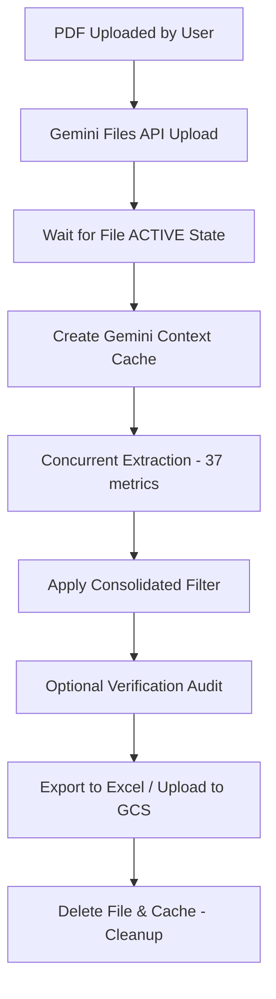

# POC2: Per-Metric Caching Extractor & Streamlit UI

This directory contains the Proof-of-Concept 2 (POC2) implementation of the Financial Metrics Extractor. It isolates metric extraction by querying the model metric-by-metric against a cached PDF.

---

## 🛠️ Commands & Running

Always activate the project virtual environment before running commands.

### Environment Setup
- **Virtual Environment**: `.nair`
- **Activation**: `source .nair/bin/activate`
- **Install Dependencies**: `pip install -r requirements.txt` (or lock file `req.txt`)

### Execution Commands
- **Streamlit Web UI**:
  ```bash
  source .nair/bin/activate && streamlit run POC2/app.py
  ```
- **CLI Scale Run** (runs all PDFs in `pdfs/` sequentially):
  ```bash
  source .nair/bin/activate && python POC2/extractor.py
  ```

---

## 📁 File Directory Structure

```
POC2/
├── app.py              # Streamlit Web UI (minimalist layout)
├── extractor.py        # Core extraction pipeline (Gemini upload, caching, semaphore concurrency)
├── prompt.py           # Prompts & system instructions (analyst persona)
├── metrics.py          # Metric definitions & metadata for all 37 financial targets
├── models.py           # Pydantic schemas (extraction & verification responses)
├── gemini_client.py    # Client factory wrapper (sync & async)
├── excel_export.py     # openpyxl formatting logic for XLSX export
├── gcs_upload.py       # Google Cloud Storage integration
├── paths.py            # Path resolving utilities
├── count_pdfs.py       # Helper to count PDFs in target folders
└── merge_results.py    # Utility to merge separate XLSX files
```

---

## ⚙️ How POC2 Works



### Core Lifecycle Steps:
1. **Gemini Files API Upload**: The target PDF is sent to the Gemini API. The code waits until the file's state is `ACTIVE` (processed by Gemini).
2. **Context Caching**: A cache containing system instructions and the uploaded PDF is created. This ensures the model does not reload or re-tokenize the PDF on subsequent metric queries.
3. **Semaphore-Bounded Concurrency**: To query all metrics, the system fires asynchronous concurrent requests (default concurrency limit = 4). Each query requests a single target metric.
4. **Consolidated Filter**: A post-extraction filter checks if any found row for a metric has `entity_context == 'Consolidated'`. If true, standalone rows for that metric are discarded.
5. **Verification**: For every extracted row, a separate prompt asks the model to verify if the extracted value is accurate and matches the metric's semantic definition.
6. **Cleanup**: In a `finally` block, both the cached content and uploaded files are deleted to ensure no files persist in the Gemini API workspace.

---

## ⚠️ Key Challenges & Flaws to Address in POC2
The current stable approach (POC2) has several structural limitations that we aim to address in future revisions:

1. **API Request Volume & Rate Limiting (429s)**: Concurrent targeted per-metric queries (37+ calls per document) cause massive traffic, triggering rate limits.
2. **High Latency & Token Overhead**: Repeated cache querying adds latency and increases input token costs.
3. **Lack of Cross-Metric Verification**: Isolated querying prevents logic checks (e.g. checking if Operating Income + D&A equals EBITDA).
4. **All-or-Nothing Resumption**: Lack of metric-level checkpoints means crashes require restarting the whole file.
5. **Context Window Limits**: Extremely large files exceed context limits without intelligent page-range pre-filtering.
6. **Rigid Schema Rejections**: Validation failures in one row shouldn't result in dropping otherwise valid financial data.

---

## 📝 Working & Engineering Guidelines

### 1. Context Engineering & Caching
- **Context Caching Lifecycle**: Uploaded files must be cached along with system instructions. Caching is billed, but avoids token reprocessing on subsequent queries. Maintain cache TTL to cover the duration of the run.
- **Large Document Processing**: Large annual reports can exceed context boundaries or cache limits. When handling context windows, prioritize core financial statements (e.g., balance sheet, income statement, cash flow statements, notes to financial statements).
- **Token Efficiency**: Pre-flight checks (`count_tokens`) are free and should be used to log and protect against hitting model context ceilings before generating billed content.

### 2. Prompt & AI Engineering
- **Targeted Querying**: Instead of extracting all 22+ metrics in a single giant prompt (which dilutes attention and leads to false negatives/missed disclosures), query each metric definition individually.
- **Analyst Persona**: The system instruction must define a senior financial analyst persona with 15+ years of experience. Prompts must specify strict boundaries (e.g. absolute constraints on currency, exact year matching, and context capture).
- **Structured JSON Schema**: Use `response_schema` in the `GenerateContentConfig` to enforce Pydantic schemas. Enforcing structured output at the API level prevents formatting failures, though retry logic must handle schema-compliant empty responses or validation glitches.
- **Non-Determinism Mitigation**: Set `temperature=1.0` or as appropriate, and pin seed values (`seed=42`) and `top_k=1` where deterministic extraction is required.

### 3. Financial Context & Extraction Rules
- **Consolidated Preferential Filtering**: In financial disclosures, Consolidated numbers represent the true parent company state. The pipeline must filter out Standalone rows if Consolidated rows are present for a given metric.
- **Exact Year & Period Matching**: Financial years can be offset (e.g. fiscal year ending March 31 vs December 31). Extracted rows must explicitly capture the correct target year and period context to avoid misattributing metrics.
- **Definition Alignment**: Match values strictly against the semantic definitions defined in `metrics.py` (e.g. EBIT vs EBITDA, cash earnings vs operating income). The verification layer operates as a secondary semantic audit against these definitions.

### 4. Streamlit UI State Management (Atomic-Swap)
- To prevent losing extraction results during UI re-renders:
  - Cache results in `st.session_state`.
  - Execute the extraction into local variables and only update `st.session_state` on a successful finish. Never clear previous results on a fresh run start in case the new run fails.
