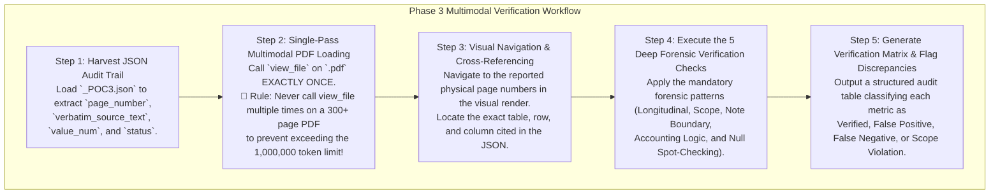

# Master Standard Operating Procedure (SOP): Phase 3 Visual Verification Audit & Forensic Methodology

**Document Purpose:** This SOP defines the exact methodology, multimodal verification workflows, and deep forensic inspection patterns required when conducting a Phase 3 Visual Verification Audit on financial metrics extracted from Annual Report PDFs.  
**Target Audience:** Senior Financial Auditors, Forensic Accounting Subagents, and AI Verification Pipelines.  
**Core Philosophy:** *Verification is NEVER just checking if a printed number matches an extracted JSON value.* True verification requires auditing the longitudinal consistency across years, the physical page headers, the entity scope, the note boundaries, and the underlying accounting logic.

---

## Section 1: The Multimodal Verification Workflow (How `view_file` is Used)

In Phase 3, we transition from text-based scraping to **visual forensic inspection** by leveraging multimodal PDF rendering via the `view_file` tool. This loads the exact physical layout, typography, table structures, and running headers of the Annual Report into the AI's visual context window.



### 🚨 Critical Token & Context Optimization Rule for `view_file`
Annual Report PDFs contain hundreds of pages of high-resolution scans and complex tables. 
* **The Rule:** When assigning an audit subagent to a fiscal year, the agent must call `view_file` on the source PDF **EXACTLY ONCE**. 
* **Why:** Calling `view_file` multiple times on a large PDF will rapidly saturate the context window and trigger a >1,000,000 token limit error. The agent must load the PDF once, retain the visual pages in context, and perform all 37 metric checks across those loaded pages in a single comprehensive pass.

---

## Section 2: The 5 Deep Forensic Verification Patterns (What You Forced Us to Notice)

When an AI initially performs a verification check, it often falls into the **"Superficial Matching Trap"**—if the JSON says EBITDA is `685.19` and the visual page shows `685.19`, the AI prematurely marks it as *"Verified & Correct"*. 

Through rigorous human-in-the-loop auditing across FY13, FY14, and FY15, we discovered that superficial matching misses severe structural hallucinations. To prevent this, every future audit **must explicitly enforce the following five forensic verification patterns**:

### Pattern 1: Longitudinal Cross-Year Consistency (The "Why Did It Change?" Rule)
* **What we observed:** In FY13 and FY14, both `EBITDA` and `Adjusted EBITDA` extracted the exact same numbers (`685.19` and `703.65`) from the phrase *"Profit before Interest, Depreciation and Exceptional Items"*. But in FY15, for the **exact same verbatim phrase**, `Adjusted EBITDA` returned `null`!
* **How we detected it:** By aligning extracted metrics side-by-side across multiple consecutive years in a comparative matrix.
* **The Mandatory Verification Rule:** 
  > **Never verify a fiscal year in isolation!** Always cross-reference the current year's extraction against the prior 2–3 years. If a metric was extracted from a specific verbatim phrase in FY13/FY14, but returns `null` or a completely different table type in FY15, **flag it immediately as a Longitudinal Anomaly / Literalism Bug**. Investigate why the exact same phrasing was accepted in one year and rejected in another.

---

### Pattern 2: Visual Header & Entity Scope Audit (Consolidated vs. Standalone)
* **What we observed:** In all three years, the AI extracted EBITDA (`685.19`, `703.65`, `994.41`), EBITDA Margin (`15.06%`), and Cash Earnings (`511.69`) from **Standalone** tables in the Directors' Report or MD&A, completely ignoring statutory Consolidated statements located later in the PDF!
* **How we detected it:** By looking beyond the number table and visually reading the **running page header** at the very top of the physical page and the **chapter/section title**.
* **The Mandatory Verification Rule:**
  > **A number match is invalid if the entity scope is wrong!** When viewing the physical PDF page, the auditor must explicitly check the top running header and section title. 
  > * If the header reads *"Standalone Financial Statements"*, *"Directors' Report"*, or *"Management Discussion & Analysis"*, the auditor must actively check the Table of Contents to verify if **Consolidated Financial Statements** exist in that annual report.
  > * If Consolidated statements exist, but the extraction grabbed a Standalone figure, the auditor must **FAIL the verification** and flag it as a **Scope Preference Violation / Ranking Error**.

---

### Pattern 3: Footnote & Section Boundaries (The Segment & Subsidiary Trap)
* **What we observed:** For FY15 `Adjusted EBIT`, the AI extracted `66,186.76` Lacs from Page 165. For FY15 `Collections`, it extracted `505.62` Lacs from Page 148. Superficial matching would say *"The number 66,186.76 is right there on page 165!"* But looking at the note heading revealed Page 165 was **Note 38 (Segment Information)** and Page 148 was **Note 39 (Water Concession Subsidiary Project)**!
* **How we detected it:** By visually zooming out from the number table to read the **Note Number, Note Title, and introductory footnote text** at the top of the page or section.
* **The Mandatory Verification Rule:**
  > **Always audit the boundary and title of the Note!** Before verifying any figure from the Notes to Accounts, check the Note Title:
  > * If the table is inside **Note on Segment Reporting / Segment Information** (e.g., Note 38/54), **REJECT IT IMMEDIATELY** for any whole-company metric (EBIT, Revenue, EBITDA, Margin). Segment profit is a partial division result!
  > * If the table is inside a **Subsidiary / Joint Venture / Project Concession Note** (e.g., Note 39), **REJECT IT IMMEDIATELY** for group-level metrics like Collections or Debt.

---

### Pattern 4: Accounting Logic & Verbatim Label Verification
* **What we observed:** For FY15 `Cash Loss`, the AI grabbed `(9,338.38)` Lacs. Visually, that number was on Page 133. But reading the row label showed: *"NET CASH INFLOW / (OUTFLOW) FROM OPERATING ACTIVITIES"*. The AI had grabbed Operating Cash Flow (CFO) from the Cash Flow Statement instead of Income Statement Cash Loss! Similarly, for FY13 `Distributable Cash Flow`, it grabbed `361.62` Cr from *"Total amount available for appropriation"* in the Directors' Report.
* **How we detected it:** By reading the **complete verbatim row label** on the visual page and testing it against immutable accounting laws.
* **The Mandatory Verification Rule:**
  > **Verify what the line item actually represents, not just its numeric digits!**
  > * **For Cash Loss / Cash Earnings:** Check the document title. If the figure comes from the *Statement of Cash Flows* (Operating Cash Flow / CFO), **REJECT IT**. It must come from the Income Statement or MD&A cash profit table ($\text{PAT} + \text{D\&A}$).
  > * **For Distributable Cash Flow:** Check if the company is an Indian manufacturing company. Indian GAAP/Ind AS does not report DCF (an MLP/REIT metric). If the label says *"available for appropriation"* or *"retained earnings"*, **REJECT IT as a Foreign Metric Hallucination**.
  > * **For EBIT Margin vs. EBITDA Margin:** Check the math. Statutory EBIT Margin must always be numerically lower than EBITDA Margin. If the AI grabbed *"Operating Profit Margin"* for EBIT Margin without verifying depreciation exclusion, **REJECT IT**.

---

### Pattern 5: The "Null" Spot-Check Protocol (True vs. False Negatives)
* **What we observed:** In each fiscal year, 25 to 30 metrics returned `null` (0 candidates found). Initially, an auditor might skip nulls. But spot-checking FY15 revealed that `Adjusted EBITDA` was returned as `null` even though the exact phrase *"Profit before Finance Costs, Depreciation and Exceptional Items"* was clearly printed on Page 20!
* **How we detected it:** By manually navigating via `view_file` to the Directors' Report, P&L Statement, Note on Exceptional Items, and Auditor's Report to check if "null" metrics were genuinely missing.
* **The Mandatory Verification Rule:**
  > **Never assume a `null` output is correct!** For every audit, the auditor must spot-check at least 3–5 key `null` metrics:
  > * Jump to the **P&L Statement and Note on Exceptional Items**: Did the company report Exceptional/Extraordinary items? If yes, check if an Adjusted EBITDA or Adjusted EBIT figure/label was printed but ignored by the AI due to keyword literalism.
  > * Jump to the **Statutory Auditor's Report (CARO Section)**: Did the auditor certify Clause (x) regarding Cash Losses? If yes, and `Cash Loss Incurrence Status` returned `null`, flag it as a **False Negative**.
  > * Only confirm a `null` as a **True Negative** if the metric is genuinely foreign to the sector (e.g., ARPU, Constant Currency Revenue, Bookings in a steel company).

---

## Section 3: Standard Operating Procedure (SOP) Checklist for Future Audits

Whenever a subagent or verification pipeline is executed, it must enforce the following 8-point checklist before signing off on any extracted metric:

```markdown
### 📋 Master Verification Checklist
- [ ] **1. Single-Pass Loading:** Was `view_file` called exactly once on the source PDF to preserve token budget?
- [ ] **2. Longitudinal Check:** Was the metric compared against prior years to detect sudden unexplained drops to `null` or shifts in table sources?
- [ ] **3. Entity Header Audit:** Does the running header on the physical page confirm **Consolidated** statements (or valid Standalone fallback if Consolidated is absent)?
- [ ] **4. Segment Note Firewall:** Is the figure located outside of Note on Segment Information (Note 38/54)? (If inside, reject for whole-company metrics).
- [ ] **5. Subsidiary Note Firewall:** Is the figure located outside of subsidiary/project-specific footnotes (Note 39)?
- [ ] **6. Statement Type Proof:** For Cash Loss/Earnings, is the figure from an Income Statement/MD&A accrual table rather than the Cash Flow Statement (CFO)?
- [ ] **7. Accounting Identity Verification:** Does the metric satisfy basic accounting laws (e.g., EBIT Margin < EBITDA Margin; no REIT metrics in Ind AS)?
- [ ] **8. Null Spot-Check:** Were key `null` metrics (Adjusted EBITDA, CARO Cash Loss status) visually checked against the P&L and Auditor's Report to rule out keyword literalism bugs?
```
